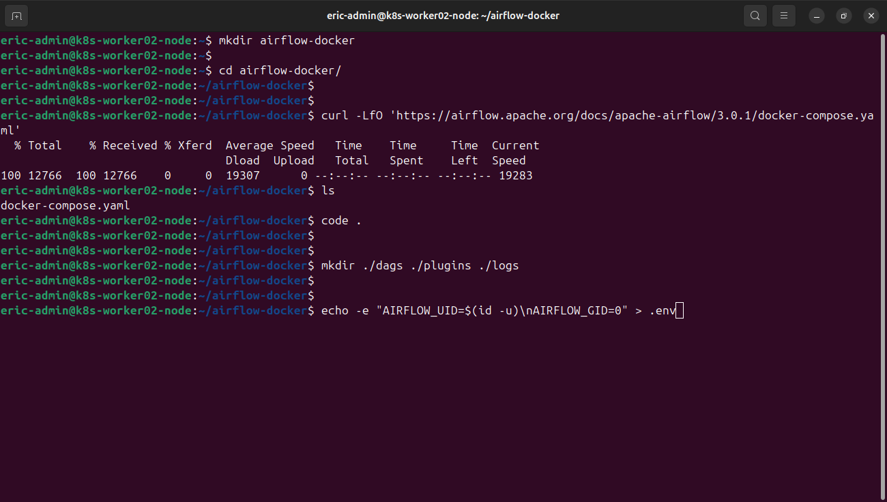
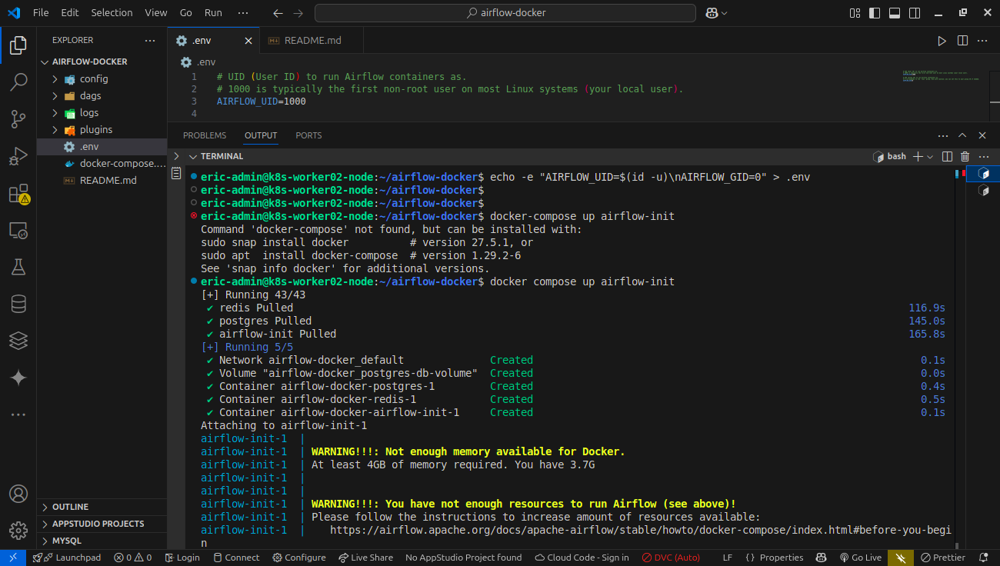

# Apache Airflow Docker Installation Guide

This guide provides step-by-step instructions for setting up Apache Airflow 3.0.1 using Docker Compose.

## Prerequisites

- Docker and Docker Compose installed
- Basic knowledge of terminal commands
- Access to port 8080 for the Airflow web interface

## Installation Steps

### 1. Create a directory for Airflow

```bash
mkdir airflow-docker
cd airflow-docker
```

### 2. Download the official docker-compose.yaml file

```bash
curl -LfO 'https://airflow.apache.org/docs/apache-airflow/3.0.1/docker-compose.yaml'
```

### 3. Create required directories

```bash
mkdir ./dags ./plugins ./logs
```

### 4. Set the user ID in the environment file

```bash
echo -e "AIRFLOW_UID=$(id -u)\nAIRFLOW_GID=0" > .env
```


### 5. Initialize the Airflow environment

```bash
docker compose up airflow-init
```

### 6. Start Airflow services

```bash
docker compose up
```

Alternatively, you can run it in detached mode:

```bash
docker compose up -d
```


## Accessing Airflow

### Web Interface

Open your browser and navigate to:
```
http://localhost:8080/
```

Default credentials:
- Username: `airflow`
- Password: `airflow`

### Interacting with Airflow CLI

You can interact with the Airflow CLI by executing commands in the running containers:

```bash
# Check Airflow version
docker exec <container_id> airflow version

# Example:
docker exec 4a043b86a37d airflow version
```

## Enabling the REST API

To enable the Airflow REST API with basic authentication:

### 1. Modify the docker-compose.yaml file

Add the following environment variable to the `x-airflow-common` section:

```yaml
AIRFLOW__API__AUTH_BACKEND: 'airflow.api.auth.backend.basic_auth'
```

### 2. Restart the Docker Compose services

```bash
docker compose down
docker compose up -d
```

### 3. Use the REST API

```bash
# List all DAGs
curl -X GET --user "airflow:airflow" "http://localhost:8080/api/v1/dags"
```

## Managing Docker Containers

```bash
# List all running containers
docker ps

# Stop all Airflow containers
docker compose down

# Remove containers, volumes, and images created by up
docker compose down --volumes --rmi all
```

## Accessing logs and troubleshooting

Logs are stored in the `./logs` directory. You can also view logs directly from the web interface.

## Additional Resources

- [Apache Airflow Documentation](https://airflow.apache.org/docs/)
- [Airflow Docker Documentation](https://airflow.apache.org/docs/apache-airflow/stable/howto/docker-compose/index.html)
